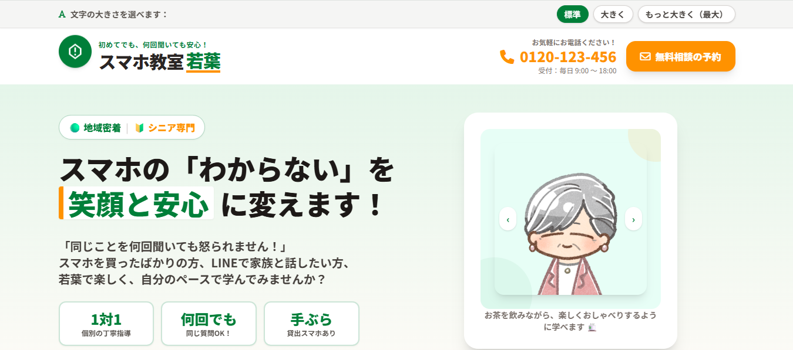

# 若葉



「初めてのスマホも、安心して学べる。」

シニア向けスマホ教室「若葉」のWebサイトです。
地域のシニアやそのご家族が安心して利用できることを目指し、見やすさ・使いやすさを重視して制作しました。

---

## 制作目的

- シニア向けスマホ教室の紹介サイト制作
- HTML・Tailwind CSS・JavaScriptの学習
- シニア層を意識したUI/UX設計の実践

## ターゲット

- スマートフォンを使い始めたシニア
- スマホ操作に不安を感じている方
- ご家族から教室を探している方

## 使用技術

- HTML5
- Tailwind CSS
- JavaScript
- GitHub Pages

## 実装機能

- レスポンシブ対応
- 文字サイズ変更機能
- 画像スライダー
- FAQアコーディオン
- LINE相談モーダル
- お問い合わせフォーム
- カウントダウンタイマー

## 工夫したポイント

- シニア層でも読みやすい文字サイズや余白を意識したデザイン
- 電話・LINEなど、利用者が使い慣れた連絡手段を目立つ位置に配置
- アクセシビリティ向上のため文字サイズ変更機能を実装
- FAQや画像スライダーを取り入れ、安心感や親しみやすさを表現
- スマートフォン・タブレット・PCに対応したレスポンシブデザインを実装

## ディレクトリ構成

```
wakaba/
├── img/
├── index.html
└── README.md
```

## 公開ページ

https://pluto007-lab.github.io/wakaba/

## 学んだこと

- Tailwind CSSを活用したレイアウト構築
- JavaScriptによるインタラクティブな機能実装
- GitHub PagesでのWebサイト公開
- 利用者目線で情報の配置や導線を改善する重要性

## 今後改善したい点

当初はアクセスマップと駅からの行き方を離して配置していましたが、地図を見ながら経路を確認しづらいという課題がありました。

そのため、アクセスマップの直下に駅からの行き方を配置するレイアウトへ改善しました。これにより、地図と案内を同時に確認しやすくなり、シニア層でも迷わず情報を把握できる構成を意識しました。

今後はフォームの入力補助やアクセシビリティをさらに改善し、より使いやすいサイトを目指したいと考えています。

## 制作

職業訓練校でのWeb制作課題として制作しました。
